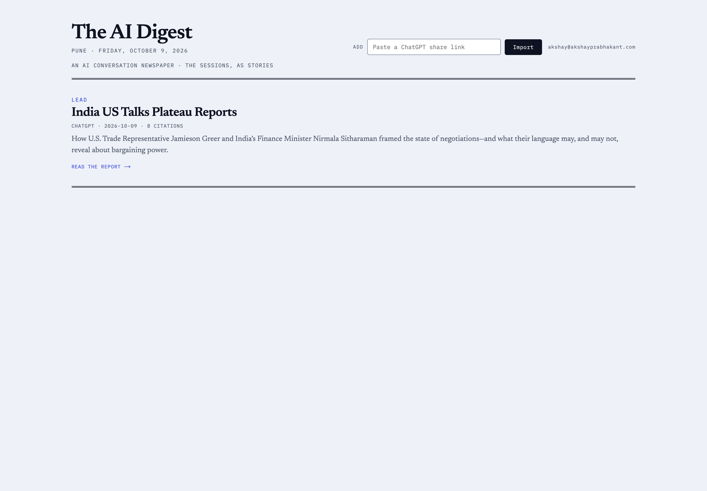
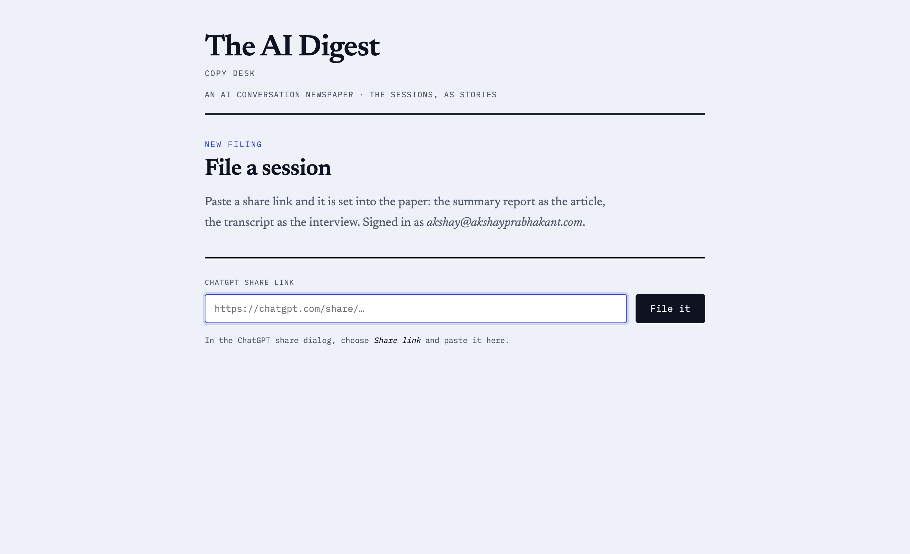
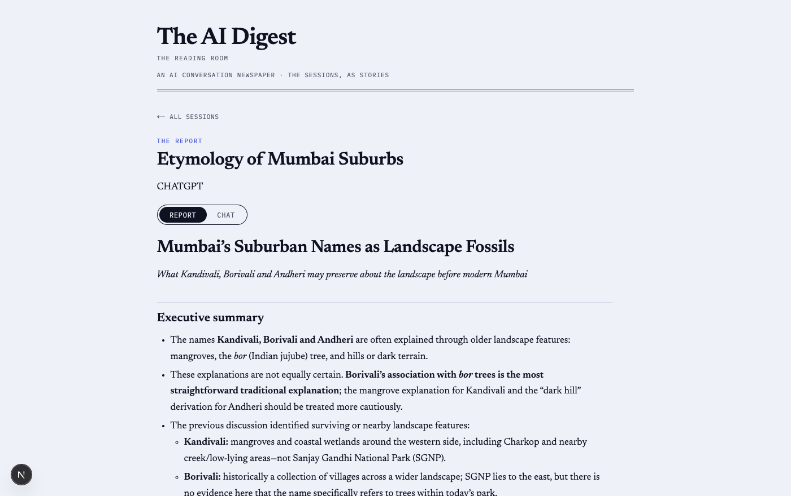
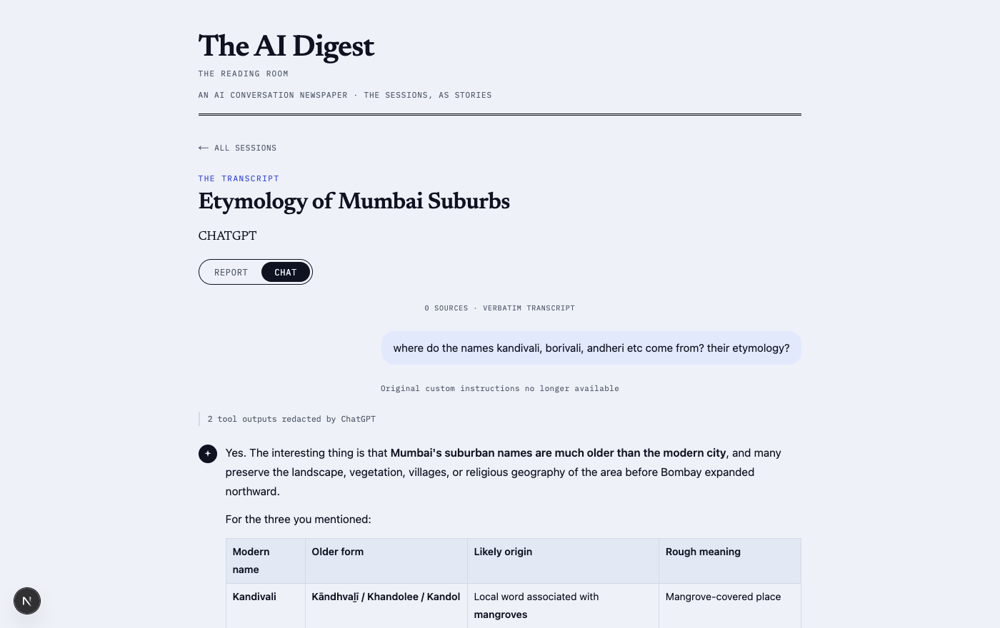
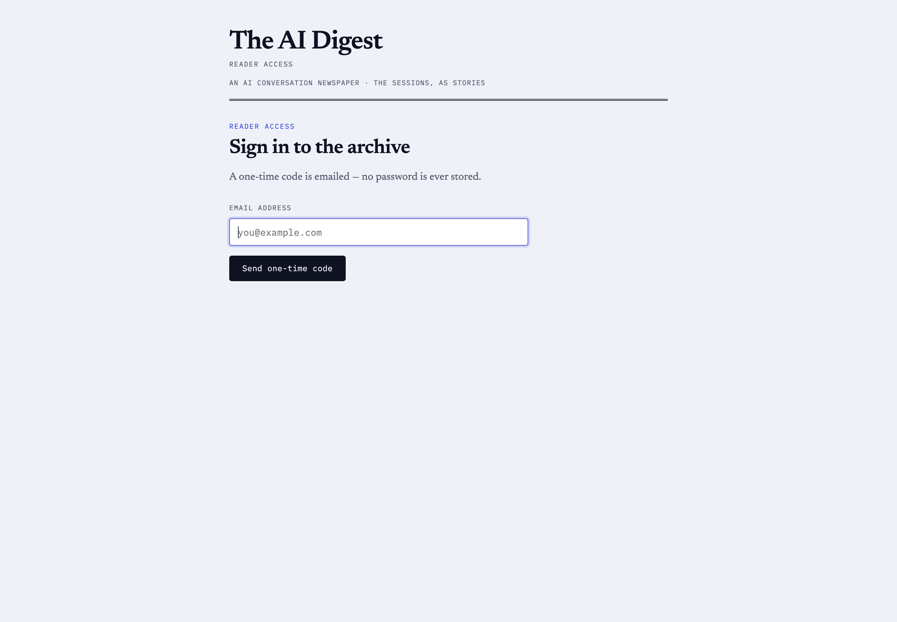
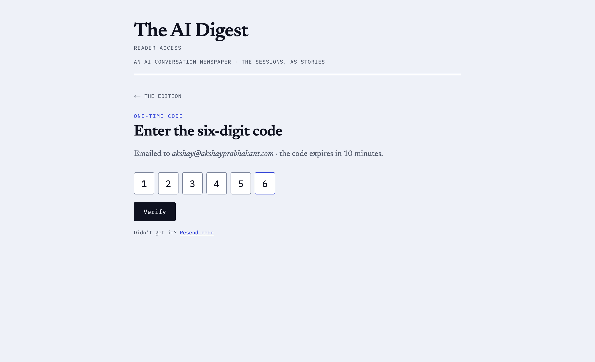
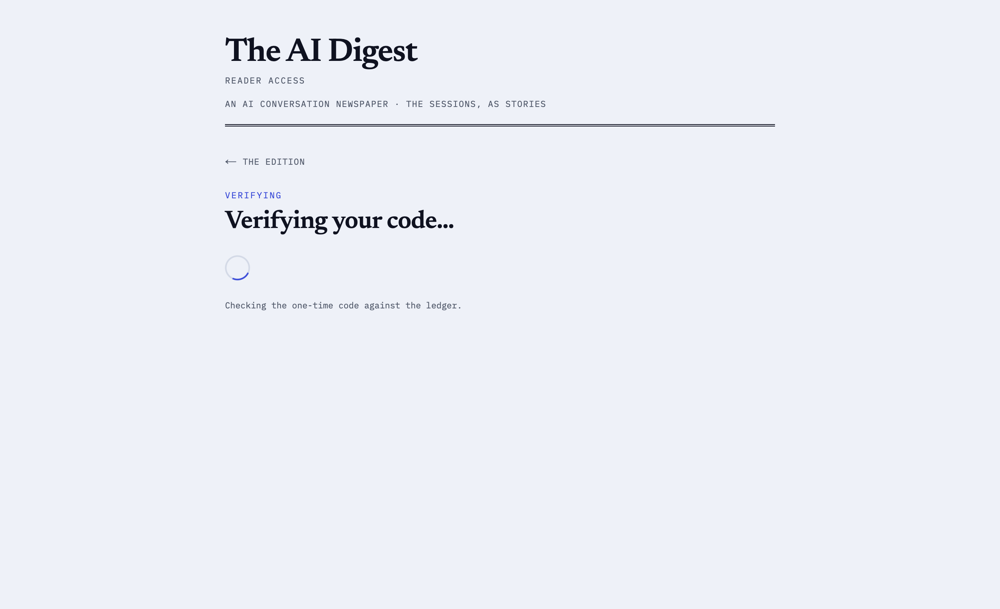
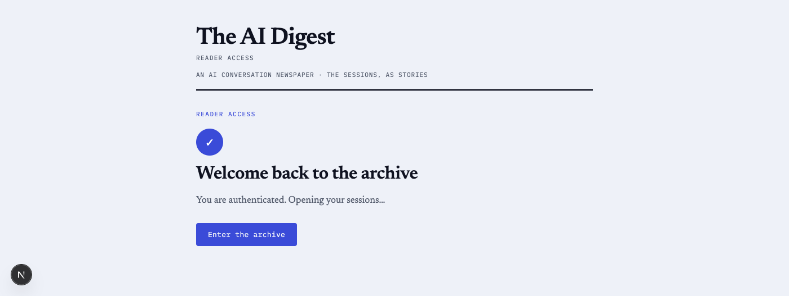

# ai-chat-archive

**The AI Digest** — archive your AI assistant chat sessions (transcript + markdown
report) into Cloudflare D1 by pasting a ChatGPT share link, and read them back as
a newspaper. See `plan.md` for the full design.

## Screenshots

### The front page

Sessions laid out as a newspaper front page: two leads above the fold, a third
heading the flow beneath, then three columns that each run to their own ragged
depth. **Public, and the same edition for everyone.** The only control in the
masthead is Sign in — no import box, and no email address, on a page anyone can
read.



### The copy desk — `/chat-archives/desk`

Where a share link becomes a story. Reached by signing in, and gated: the
filing endpoint is the only write in the product. One job, one page — the form,
and nothing else. It is also the one place your address is shown back to you,
on a page that requires signing in.



### Reading a session — the report

The generated markdown report, rendered as an article. Inline `[n]` citation
markers are linked through to their entry in the bibliography at the foot of the
page.



### Reading a session — the chat

The same session as a verbatim transcript, rendered the way ChatGPT renders it:
user turns in a bubble, assistant turns as plain prose, redacted tool calls
collapsed into a single counted note. The Report/Chat toggle at the top swaps
between the two views.



### Signing in

Email → one-time code → verifying → confirmed. The *screen* is ours; what
verifies the code depends on the identity provider (see `docs/access-limits.md`
for why Cloudflare Access cannot sit behind this page). Until the provider is
chosen, a local server stands in for it.

| Email | One-time code |
| :---: | :---: |
|  |  |

| Verifying | Confirmed |
| :---: | :---: |
|  |  |

## Who can see what

| Route | Anyone | Signed in |
|---|---|---|
| `/chat-archives` — the edition | **every filed story** | same |
| `/chat-archives/<share-id>` — one story | **readable** | readable |
| `/chat-archives/login` — sign in | screen | redirects to the desk |
| `/chat-archives/desk` — file copy | redirected to sign in | the filing form |

One rule, stated once: **public reads, private writes.** The only gated actions
are `POST /api/ingest` and `GET /api/filings`.

Ownership is still recorded (`conversations.owner_email`) but it is *provenance,
not an access boundary*, and it never leaves the server on a read: it keys the
upsert, scopes the desk's "your recent filings" query, and is returned by exactly
one endpoint — `/api/whoami`, to the person it belongs to. No listing carries an
address, because `/api/sessions` answers anonymous visitors and a per-row address
there would publish every filer's email in the JSON. The upsert key remains
`(owner_email, external_id)`, so two people can file the same share link and both
are in the edition.

Provenance is also what makes the other sources cheap to add: `conversations.source`
is already `chatgpt | gemini | claude | elicit`, and each becomes another
implementation of the parser ports rather than a change to this model.

### Why the copy desk and the sign-in screen have their own paths

Cloudflare Access scopes an application by **path**, and a query string is not
part of a path:

> "Query strings (such as `?foo=bar`) are not supported in Access application
> paths." — [Access application paths](https://developers.cloudflare.com/cloudflare-one/access-controls/policies/app-paths/)

So `?desk` or `?login` can never be given their own policy. As real paths they
can, and Access's wildcard rules separate all four routes:

| Access application | Covers | Does not cover |
|---|---|---|
| `…/chat-archives` | the edition | login, desk, stories |
| `…/chat-archives/login` | sign in | everything else |
| `…/chat-archives/desk` | **filing — the one path to protect** | everything else |
| `…/chat-archives/*` | login, desk, stories | the edition |

Access has **no HTTP-method selector** at all (its documented selectors are
emails, IPs, countries, device posture, IdP groups, service tokens — no verbs),
so "public GET, private POST" is written in `entry.py`, not in a policy.
`docs/access-limits.md` has the citations.

## Structure

```
backend/     Python — Cloudflare Workers backend (ingest + list API, D1)
frontend/    TypeScript + Next.js — the newspaper front page and reader
design/      HTML explorations behind the front page and auth screens
docs/        research notes and screenshots
plan.md      the agreed design (storage, auth, hardening, verified facts)
```

### Backend (Python, SOLID/OOP)

```
backend/
├── chat_archive/
│   ├── entry.py            # Workers entrypoint + composition root + routing
│   ├── auth.py             # IdentityProvider port: who is asking?
│   ├── urls.py             # path/query helpers + the open-redirect guard
│   ├── ports.py            # interfaces (ABCs): ShareFetcher, PayloadDecoder,
│   │                       #   ConversationParser, ConversationRepository
│   ├── models.py           # domain dataclasses (Message, Citation, Conversation)
│   ├── service.py          # ShareService use case (SSRF guard + orchestration)
│   ├── serializers.py      # wire shape shared by the Worker and local server
│   ├── repository.py       # D1ConversationRepository
│   ├── sqlite_repository.py    # local development (+ in-place schema migration)
│   ├── local_repository.py     # in-memory test double
│   └── chatgpt/            # vendor implementations of the ports
│       ├── fetcher.py      # HttpShareFetcher
│       ├── decoder.py      # ChatGptFlightDecoder (RSC flight unpacking)
│       └── parser.py       # ChatGptParser (transcript / report / citations)
├── local_server.py         # runs the same service off-Cloudflare (stdlib only)
├── test/test_decode.py     # network test: decode + parse a real share link
├── test/test_ownership.py  # offline contract test: all 3 repositories agree
├── test/test_urls.py       # offline: the open-redirect guard
├── schema.sql              # D1 schema
├── wrangler.jsonc          # Worker + D1 binding config
└── pyproject.toml
```

Two seams do the design work:

- **`ports.py`** — adding Gemini/Claude/Elicit later means adding a new
  `chatgpt/`-style package implementing the same ports; no existing code changes
  (Open/Closed + Dependency Inversion). The repository port already has three
  implementations (D1, SQLite, in-memory) behind one interface.
- **`auth.py`** — the router asks "who is this?" and never learns how the answer
  was produced. Swapping Cloudflare Access for a self-hosted OTP flow is one new
  class.

`test/test_ownership.py` is a *contract test*: the same assertions run against
all three repositories, so an implementation that leaks another reader's shelf
fails for that implementation specifically.

### Frontend (TypeScript + Next.js)

```
frontend/
├── app/
│   ├── layout.tsx              # fonts + metadata
│   ├── page.tsx                # NOT the archive — points at /chat-archives
│   ├── globals.css             # the whole design system
│   ├── chat-archives/page.tsx        # the edition (public)
│   ├── chat-archives/login/page.tsx  # sign in (own path)
│   ├── chat-archives/desk/page.tsx   # the copy desk — file a share link
│   ├── chat-archives/[id]/page.tsx   # the reader (?chat for the transcript)
│   └── components/
│       ├── Masthead.tsx        # the nameplate
│       ├── MastheadActions.tsx # top-right slot: Sign in, or Copy desk
│       ├── FrontPage.tsx       # leads + ragged columns
│       ├── CopyDesk.tsx        # the filing form + your recent filings
│       ├── StoryLink.tsx       # one story rendered as a link
│       ├── SessionReader.tsx   # reader with the Report/Chat toggle
│       └── AuthFlow.tsx        # email → code → verifying → confirmed
├── lib/
│   ├── api.ts                  # typed API client + ApiError/isSignInRequired
│   ├── story.ts                # headline / standfirst / citation count
│   ├── citations.ts            # links [n] markers to the bibliography
│   ├── chat.ts                 # strips source tokens, groups tool notes
│   └── nav.ts                  # AFTER_SIGN_IN + safeNext (redirect guard)
├── types/index.ts
├── package.json
└── tsconfig.json
```

## Run locally

```bash
# backend offline contract test (no network, no Cloudflare account)
python3 backend/test/test_ownership.py

# backend network test (needs a live ChatGPT share link)
python3 backend/test/test_decode.py

# backend API server (SQLite, persists to backend/archive.db)
python3 backend/local_server.py            # → http://127.0.0.1:8787

# frontend (separate terminal)
cd frontend && npm install && npm run dev  # → http://127.0.0.1:3000
```

Open <http://127.0.0.1:3000/chat-archives>.

The frontend defaults to `http://127.0.0.1:8787` for the API; override with
`NEXT_PUBLIC_API_BASE`.

The local server stands in for Cloudflare Access with a fixed reader
(`DEV_EMAIL`, default `akshay@akshayprabhakant.com`). To watch the signed-out
state:

```bash
DEV_EMAIL= python3 backend/local_server.py          # every shelf is 401
curl -H 'X-Archive-Email;' localhost:8787/api/sessions   # 401, one request
curl -H 'X-Archive-Email: guest@example.com' localhost:8787/api/sessions
```

`X-Archive-Email` exists **only** in the local server. The deployed Worker
derives identity from its `IdentityProvider` and never trusts a client header,
because a client can lie.

## Deploy

1. `cd backend && npx wrangler d1 create ai-chat-archive` → copy the id into
   `wrangler.jsonc`.
2. `npx wrangler d1 execute ai-chat-archive --remote --file=schema.sql`.
3. `npx wrangler deploy`.
4. Verify the identity wiring actually reached the origin —
   `curl https://akshayprabhakant.com/api/health` should report
   `"context_available": true`. `ctx.access` is documented for JavaScript;
   `/api/health` is how the deployed Python Worker proves or disproves that it
   exists, instead of every request 403ing with no explanation.
5. Cloudflare Access is then an **optional outer lock**, not the authority: it
   matches hostname/path only, so it cannot express the public-read table above.
   Keep `"workers_dev": false` so the Worker is reachable only through the
   custom domain.

